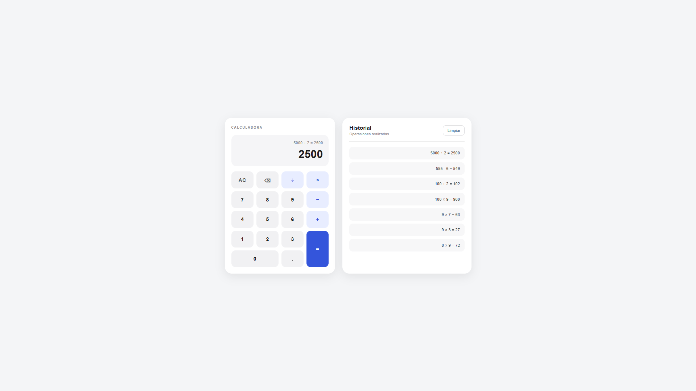

# Tarea 2 - Calculadora WEB

Calculadora web realizada con HTML5, CSS3 y JavaScript (ES5).

Permite realizar operaciones de suma, resta, multiplicación y división, además de guardar el historial de operaciones utilizando localStorage.

## Captura

## Autor

Robert Leclerc